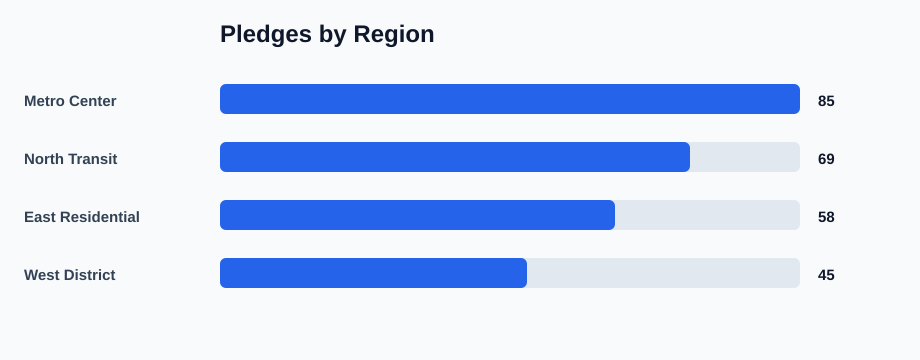
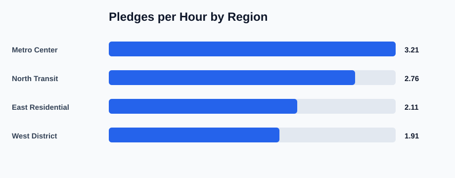
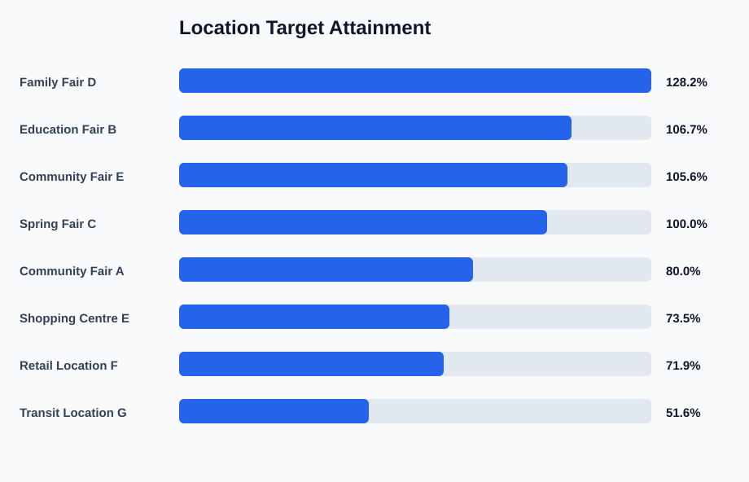

# Nonprofit Fundraising KPI Analysis

This is a beginner-friendly data analytics portfolio project based on face-to-face fundraising operations. It demonstrates KPI monitoring, location performance analysis, team reporting, and data-driven planning using fictional sample data.

## Project Context

Fundraising team leaders need to understand both activity volume and conversion quality. A strong location or route is not only the place with the most conversations. It should also produce pledges efficiently, meet target productivity, and support good planning decisions.

This project analyzes two public-safe sample datasets:

- regional activity performance
- stand and fair location performance

## Data Privacy Note

The data in this project is fictional and created for portfolio use. It does not contain private organizational data, real employee-level performance, real route strategy, or exact confidential location results.

## Project Goals

- Compare pledge performance by region
- Calculate conversation rate and pledge conversion rate
- Compare pledges per hour across regions
- Compare achieved PPH against target PPH by location
- Classify locations for future planning decisions
- Produce simple charts and written insights

## Tools Used

- Python
- CSV
- KPI calculations
- Business reporting
- SVG charts generated with Python

## Dataset

The sample datasets are stored in:

- `data/fundraising_kpi_sample.csv`
- `data/location_performance_sample.csv`

Important columns include:

- region
- activity type
- doors knocked
- conversations
- pledges
- total monthly value
- active hours
- location type
- target PPH
- achieved PPH
- average monthly donation

## KPI Definitions

Conversation rate:

```text
conversations / doors_knocked
```

Pledge rate:

```text
pledges / conversations
```

Pledges per hour:

```text
pledges / active_hours
```

Target attainment:

```text
achieved_pph / target_pph
```

Average monthly donation:

```text
total_monthly_value_eur / pledges
```

## How to Run

From this project folder:

```bash
python src/analyze_kpis.py
```

The script creates:

- `outputs/area_kpi_summary.csv`
- `outputs/location_kpi_summary.csv`
- `outputs/insights.md`
- `outputs/pledges_by_region.svg`
- `outputs/pledges_per_hour_by_region.svg`
- `outputs/location_target_attainment.svg`

## Output Preview

### Pledges by Region



### Pledges per Hour by Region



### Location Target Attainment



## Key Skills Demonstrated

- Data cleaning and grouping
- KPI calculation
- Performance comparison
- Location planning logic
- Business-focused interpretation
- Clear project documentation
- Public-safe handling of professional-style analysis

## Example Insights

- Identify the highest-performing region by total pledge volume.
- Identify the most productive region by pledges per hour.
- Compare location performance against target PPH.
- Mark weak locations for review before repeating.
- Use weekly reporting to support coaching and planning.

## Next Improvements

- Build a Power BI dashboard from the same sample data
- Add a simple Excel dashboard version
- Add monthly trend analysis
- Add a public-safe map using fictional coordinates
- Add SQL queries for the same dataset
