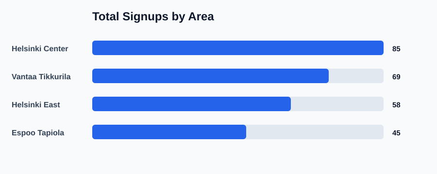
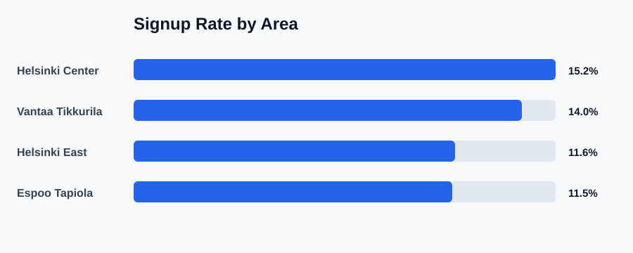

# Fundraising KPI Analysis

This is a beginner-friendly data analytics project based on fundraising team performance. It reflects real skills from my professional background: KPI monitoring, area performance analysis, team reporting, and data-driven planning.

## Project Context

In fundraising operations, team leaders need to understand more than total signups. They need to compare areas, conversation quality, signup conversion, donation value, and productivity. This project uses fictional sample data to demonstrate that kind of KPI thinking.

## Project Goal

The goal is to analyze sample fundraising activity data and answer simple business questions:

- Which areas performed best?
- Which areas had the strongest signup rate?
- How many conversations turned into signups?
- Which areas generated the highest donation value?
- What recommendations can improve planning?

## Tools Used

- Python
- CSV
- Basic KPI calculations
- Business reporting
- SVG charts generated with Python

## Dataset

The sample dataset is stored in:

`data/fundraising_kpi_sample.csv`

Columns include:

- Date
- Area
- Team leader
- Doors knocked
- Conversations
- Signups
- Donations in EUR
- Active hours

## KPI Definitions

Conversation rate:

`conversations / doors_knocked`

Signup rate:

`signups / conversations`

Average donation per signup:

`donations_eur / signups`

Signups per hour:

`signups / active_hours`

## How to Run

From this project folder:

```bash
python src/analyze_kpis.py
```

The script creates:

- `outputs/area_kpi_summary.csv`
- `outputs/insights.md`
- `outputs/signups_by_area.svg`
- `outputs/signup_rate_by_area.svg`

## Output Preview

### Total Signups by Area



### Signup Rate by Area



## Key Skills Demonstrated

- Data cleaning and grouping
- KPI calculation
- Performance comparison
- Business-focused interpretation
- Clear project documentation

## Key Insights

- Helsinki Center had the highest total signups.
- Helsinki Center also had the strongest signup rate.
- Vantaa Tikkurila was the second-best area by total signups.
- Espoo Tapiola had the lowest signup volume and should be reviewed for planning or coaching improvements.

## Next Improvements

- Add charts using Excel or Power BI
- Create a dashboard screenshot
- Add monthly trend analysis
- Add geographic coordinates for map-based analysis

## Portfolio Note

This project uses sample data only. It does not contain private or internal work data.
